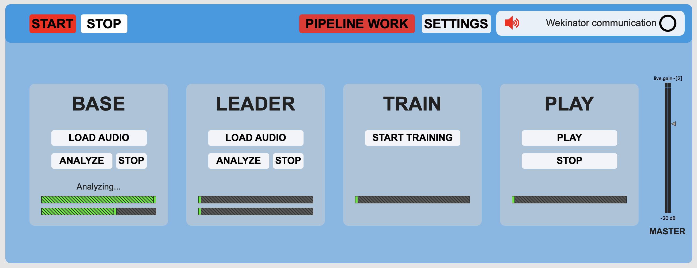

# Processi Musicali Automatici ed Interattivi

### Gastaldi Paolo

| Progetto esame del 23/10/2020 | |
| :- | :-: |
| Versione | 1.3.0 - fft formants |
| Data | 28/10/2020 |

## Colors

- RED: on, selected
- WHITE: off

(only top bar buttons can change their color)

## Top bar

- **START**: start the system, enable audio and start Wekinator communication. The top-right led blinks  if the Wekinator communication is working.
- **STOP**: stop the system, disable audio and stop Wekinator communication.
- **PIPELINE WORK**: analyze/train a block and when it finishes do the same for all the blocks to its right.
- **SETTINGS**: open the following window:

## Settings

- **LOAD BUFFER FROM FILE**: select a file to load Mubu buffer content.
- **SAVE BUFFER INTO FILE**: select a file to save Mubu buffer content into.
- **EMPTY BUFFERS**: soft reset of Mubu buffers: empty tracks without removing them.
- **HARD RESET**: clear all buffers and recreate tracks.
- **SAVE RESULTS ON FILE**: select a file and record what you will play.
- **BASE / LEADER**:
	+ **PITCH COEFFICIENT**: manage pitch correction.
	+ **STRESS COEFFICIENT**: manage loudness correction.
- **SYLLABLE SLICE**:
    + **PRE / POST**: select how much expand each syllable window.

## BASE / LEADER

- **LOAD AUDIO**: select an audio file.
- **ANALYZE**: start syllable slicing and categorization. These two steps are performed in parallel. This procedure can take a while. When you start analysis, all previous data into non-audio buffers will be cancelled.
- **STOP**: stop analysis.

## TRAIN:

- **START TRAINING**: update the final mubu.knn content.

## PLAY:

- **PLAY**: start playing from the beginning.
- **STOP**: stop playing.

## General:

- **MASTER**: manage the output audio volume. This slider do not control the recording audio.

