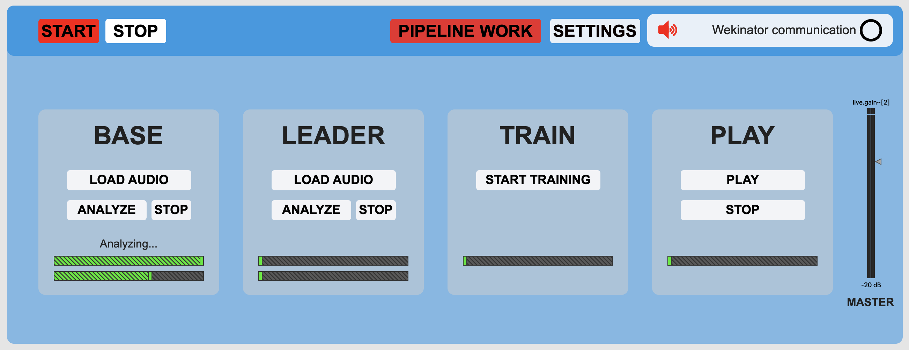
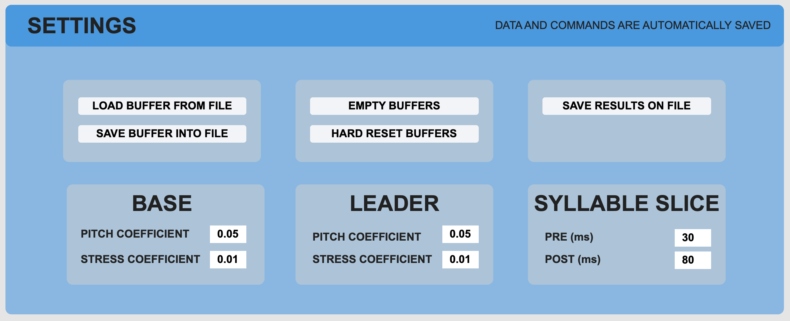
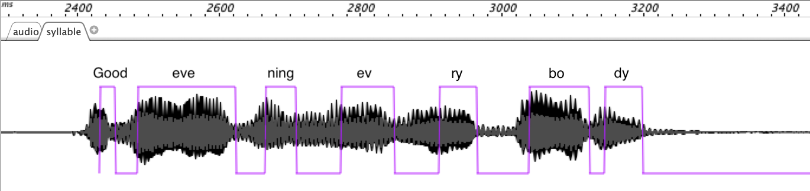
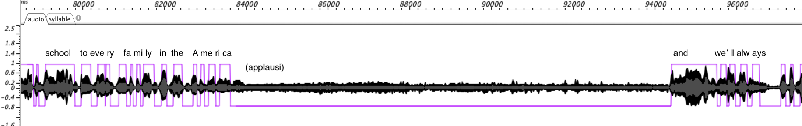

# Processi Musicali Automatici ed Interattivi

### Gastaldi Paolo

| Progetto esame del 23/10/2020 | |
| :- | :-: |
| Versione | 1.3.0 - fft formants |
| Data | 28/10/2020 |

## Indice

+ [Abstract](#abstract)
+ [Obiettivi](#obiettivi)
+ [Come funziona](#come-funziona)
+ [Risultati ottenuti](#risultati-ottenuti)
+ [Informazioni tecniche](#informazioni-tecniche)
    - [Andiamo nel dettaglio](#andiamo-nel-dettaglio)
    - [Usiamo Wekinator](#usiamo-wekinator)
    - [Dipendenze esterne](#dipendenze-esterne)
    - [Difficoltà riscontrate](#difficoltà-riscontrate)

## Abstract

Troppo spesso quando ascoltiamo un discorso ci facciamo influenzare da chi lo stia dicendo, perdendo il significato delle parole che dice. Distaccare le due parti sembra impossibile. E se fosse qualcun altro a pronunciare quel discorso? Stesse parole, stesse frasi, solamente una diversa voce dietro al microfono. Quasi a elevare il discorso in sé a una composizione, a niente più che uno spartito caratterizzato dalle sue sillabe, strutturato nelle sue frasi e colorato con le inflessioni della voce; per andarne poi a cambiare l'esecutore. Forse in quel caso il vero significato ci salterebbe più all'occhio, capiremmo veramente che peso hanno le parole che vengono pronunciate e saremmo in grado di analizzare meglio il discorso.

## Obiettivi

Gli obiettivi del progetto sono di:

- estrapolare le sillabe da un discorso
- analizzare ogni sillaba e trovare dei parametri caratterizzanti per  descriverla nella maniera più accurata possibile
- ricreare un discorso con i frammenti di un altro discorso precedentemente analizzati
- correggere le inflessioni della voce adattandole al discorso originale

## Come funziona

Prima di avviare la patch Max è necessario aprire Wekinator e caricare il progetto `wek_fft_formants_2` presente nella cartella _models_. Questo progetto contiene un modello già pronto per la catalogazione di consonanti e vocali.

> Per una rapida descrizione della patch guardare il file _QUICKSTART_.

La patch principale è ```speech_switch``` che ha il seguente aspetto:



Nella barra superiore si trovano i comandi generali per la gestione della patch:
- **START**: avvia il sistema
- **STOP**: spegni il sistema
- **PIPELINE WORK**: automatizza le analisi (vedere sotto)
- **SETTINGS**: impostazioni del del sistema (vedere sotto)

Il riquadro in alto a destra è un piccolo monitor del sistema per vedere se l'audio e la comunicazione con Wekinator stanno funzionando.

> Esempio: premi su _START_. Dovresti vedere il led vicino a _Wekinator communication_ lampeggiare 2 volte e l'audio accendersi.

### SETTINGS



- **LOAD BUFFER FROM FILE**: carica i buffer MuBu da file
- **SAVE BUFFER INTO FILE**: salva i buffer MuBu su file
- **EMPTY BUFFERS**: svuota i buffer MuBu con i dati delle analisi
- **HARD RESET BUFFERS**: elimina e ricrea tutte le tracce dai buffer MuBu. Utile quando MuBu inizia a fare cose strane
- **SAVE RESULTS ON FILE**: seleziona un file dove registrare la prossima esecuzione
- **PITCH COEFFICIENT**: coefficiente per la correzione del pitch su _BASE_/_LEADER_
- **STRESS COEFFICIENT**:  coefficiente per la correzione degli accenti su _BASE_/_LEADER_
- **PRE/POST**: correzione dell'onset/offset finestra della sillaba

> Esempio: premere _LOAD BUFFER FROM FILE_ e selezionare _obama_trump_svm.mubu_ dalla cartella _models_.
 
### BASE

Questo blocco fa riferimento alla voce a cui si vorrà sentire pronunciare il discorso.

- **LOAD AUDIO**: seleziona il file audio
- **ANALYZE**: inizia l'analisi del file audio. Questa operazione cancellerà tutti i dati delle analisi precedenti
- **STOP**: interrompi l'analisi

Nella parte inferiore del blocco ci sono anche 2 progress bar, la prima per la divisione del file audio in sillabe e la seconda per la catalogazione. Le due operazioni vengono svolte (circa) in parallelo e potrebbero impiegare molto tempo. Al termine di entrambe comparire il messaggio _Done_.

> Esempio: premere su _LOAD AUDIO_ e selezionare il file _obama_1.mp3_ dalla cartella _./examples_. Non avviare l'analisi.

### LEADER

Questo blocco fa riferimento alla voce da cui si vuole estrapolare il discorso.

Per il funzionamento fare riferimento alla descrizione del blocco _BASE_.

> Esempio: premere su _LOAD AUDIO_ e selezionare il file _trump_1.mp3_ dalla cartella _./examples_. Non avviare l'analisi.

### TRAIN

Sezione necessaria all'allenamento del sistema che associa le sillabe del leader alle sillabe della base.

**ATTENZIONE**: questo passaggio è necessario anche se si caricano dei buffer da file.

> Esempio: premere su _START TRAINING_.

### PLAY

Effettua l'esecuzione del discorso ricostruito.

- **PLAY**: avvia l'esecuzione da capo
- **STOP**: interrompi l'esecuzione

In caso sia stato scelto un file dove salvare il risultato prodotto, questi controlli gestiscono anche l'avvio e la terminazione della registrazione. Se non si preme _STOP, la registrazione termina con la fine dell'esecuzione.

### Altri controlli

Nella patch principale il pulsante _PIPELINE WORK_ permette di concatenare l'avvio delle analisi che il sistema può effettuare. Per usarlo, caricare prima entrambi i file audio per i blocchi _BASE_ e _LEADER_, quindi avviare l'analisi del blocco _BASE_. In automatico, una volta terminata l'analisi su _BASE_ partirà l'analisi su _LEADER_ e in seguito la preparazione sul blocco _TRAIN_. 

Infine, sulla sinistra lo slider controlla il master del volume di uscita. Questo non controlla però il volume dell'audio registrato.

## Risultati ottenuti

### Riconoscimento delle sillabe

La patch ```test_ZFF_2``` è stata utilizzata per creare l'immagine successiva. Il testo è stato aggiungo in seguito a mano. La porzione di audio è stata estrapolata dal discorso di Barack Obama alla Convention democratica del 2020, che inizia appunto con le parole indicate sull'immagine: *Goodevening everybody*.



Il sistema ha bisogno per ogni file audio di una doppia taratura, sia per l'attacco della sillaba (riconosciuta tramite la ricerca del movimento gutturale), sia per la sua terminazione (riconosciuta con la fine dell'emissione di frequenze formanti della sillaba, ossia delle frequenze utili a identificare la sillaba emessa).

Il sistema sembra essere sempre un po' "in ritardo" sul riconoscimento dell'inizio e della fine della sillaba. Per questo è necessario in seguito delle piccole correzioni tali da adattare meglio la finestra che racchiude la sillaba, modificando accuratamente l'onset e l'offset in fase di esecuzione.

L'utilizzo di questa tecnica si rivela interessante per la distinzione tra i frammenti parlati (voiced) e i rumori di sottofondo (unvoiced). Ecco qui di seguito un estratto dal discorso di Donald Trump alla Convention repubblicata del 2020, avvenuto alla Casa Bianca con molti ospiti.



Si può notare come gli applausi vengano evitati del sistema, benché non abbiano un'intensità sonora di molto inferiore. Questo avviene siccome non sono sufficientemente impulsivi nel loro attacco. 

### Alcune esecuzioni

Nella cartella _results_ sono possibili delle registrazioni dell'audio generato. I nomi dei file sono da intepretare nel seguente modo:

 `name1_name2_tech.ext`

 - `name1`: base audio, voce usata per pronunciare il discorso
 - `name2`: leader audio, voce da cui è stato estrapolato il discorso 
 - `tech`: algoritmo utilizzato dal Wekinator per la classificazione
 - `exxt`: estensione del file (aiff solitamente)

## Informazioni tecniche

### Andiamo nel dettaglio

L'analisi dei file audio si basa su 3 step fondamentali, applicati sia al blocca _BASE_ che al blocco _LEADER_.

Dopo aver selezionato il file audio e avviato l'analisi, il primo step consiste nell'estrapolare i valori FFT e descrittori di Loudness e Pitch dell'intero file.

Il secondo step è il riconoscimento delle sillabe. Per farlo nella patch ```glottal_core``` viene utilizzato il sistema della ZFF, Zero Frequency Filter, una tecnica per individuare i movimenti gutturali basata su un filtro risonante a (circa) 0 Hz (per maggiori dettagli: Yegnanarayana & Gangashetty, 2011).

Ottenuta così la finestra temporale che racchiude la sillaba, si interpolano i valori della FFT e dei descrittori ottenuto al primo step e se ne calcola la media. I valori ottenuti vengono messi una coda.

Infine, i valori nella coda vengono catalogati da Wekinator (procedura solitamente molto lenta). Si ottiene una lista di probabilità che ci indicano la presenza o meno di ciascuna consonante, sillaba o dittongo.Qusti valori vengono salvati assieme ai relativi valori di Loudness e Pitch all'interno di una tabella.

Dopo aver effettuato questa analisi per entrambi i file audio (quello da cui si vuole estrarre la voce e quello da cui si vuole estrarre il discorso) si effettua poi "traduzione" delle singole sillabe: tramite un oggetto ```mubu.knn``` si va a individuare la distanza minima tra le sillabe, basandoci sulle probabilità precedentemente ottenute da Wekinator.

Infine, volta individuato il frammento da riprodurre, se ne effettuano ancora alcune elaborazioni "di contorno". Viene applicato un piccolo inviluppo per evitarne un attacco e un rilascio eccessivamente impulsivi, si applicano degli inviluppi sulla loudness e sul pitch per andare a ricreare, per quanto più possibile, gli accenti e il tono della frase originale.

### Usiamo Wekinator

Questa patch basa il suo funzionamento sul modello ```wek_fft_formants_2``` creato in precedenza con Wekinator. Il modello è stato creato tramite la patch ```ML_train```.

L'idea di fondo è creare un modello capace di catalogare le vocali, le consonanti e i dittonghi con i loro suoni. La catalogazione di basa su una precedente analisi FFT. Per la FFT sono state usate 2048 finestre, ma solo le prime 256 vengono selezionate così da rappresentare l'intervallo [0, 5500 circa] Hz dove si concentrano le formanti e altre parti caratterizzanti della voce. 

Il sistema è stato quindi allenato partendo da 44 registrazioni delle unità fondamentali a cui sono stati applicati delle variazioni di pitch (l'intenzione di applicare delle operazioni di stretch, quindi di variarne la dura senza inficiarne il pitch, sono state abbandonate in seguito ad alcune difficoltà pratiche a far interagire MuBu con gli altri sistemi).

Il modello è stato creato tramite l'algoritmo SVM con kernel RGB che permette di identificare cluster dalle forme e dagli incastri molto complicati.

### Dipendenze esterne

Elenco dei pacchetti e programmi aggiuntivi esterni a Max necessari per il funzionamento della patch.

| Dipendenza | Versione |
| :-: | :-: |
| MuBu| 1.9.14 |
| Wekinator | 2.1.0.4 |

### Difficoltà riscontrate

Mubu. Mubu è il principale problema delle instabilità della patch, ma è essenziale per processare in maniera offline i file audio. Nelle ultime versione della patch l'obiettivo è stato di minimizzarne l'utilizzo, tranne dove strettamente necessario.

La taratura del sistema è molto delicata. I test sono stati effettuati con la patch ```test_ZFF_2```. Per ogni discorso selezionato è necessario effettuare una (solitamente molto lieve) ritaratura del sistema. Per questo è stato gestito nella patch ```glottal_core``` un set di messaggi appoisti per semplificarne l'operazione.

La catalogazione delle unità fondamentali (vocali, consonanti, dittonghi) è molto complicata. Nelle precedenti versioni sono stati utilizzati 5 descrittori audio, ma non sono risultati efficaci:
- loudness: per individuare la vocale associata
- perceptual spectral centroid: brillantezza
- perceptual spectral kurtosis: impulsività e accentuazione della sillaba
- perceptual crest: quanto la cresta è piatta
- perceptual skewness: rapporto tra l'attacco e la decadenza della sillaba.

Per questo la catalogazione si basa su un'analisi FFT, con risultati più interessanti.


<!--
In particolare, i descrittori scelti si sono rilevati molto efficaci nel rilevare unità fondamentali con un attacco forte (es. _d_, _t_) o con una coda (es. _s_, _f_), mentre hanno avuto risultati molto scarsi per quanto riguarda le vocali e i dittonghi.
Le generalizzazioni scelte, media e varianza, non hanno riportato un eccessiva perdita di qualità rispetto i risultati ottenuti direttamente dai descrittori. Sicuramente ne hanno beneficiate le prestazioni e il carico a cui era sottoposto il sistema.
Questo problema non è facilmente sormontabile con un sistema senza backward learning, se non con una selezione dei descrittori audio molto accurata, una generalizzazione fine e una grande quantità di campioni.
-->

<!--
Il riconoscimento delle sillabe è basato su un filtro risonante che se tarato troppo "stretto" a 0Hz e con un Q molto selettivo rischia di andare facilmente in feedback. Per questo e per permettere di rilevare anche sillabe sussurrate è stato tarato con parametri più "larghi".
Di contro, questa taratura comporta che il sistema rilevi molte più sillabe spurie dovute alle oscillazioni, soprattutto se vengono pronunciate da una voce ad alto volume o urlata.
-->