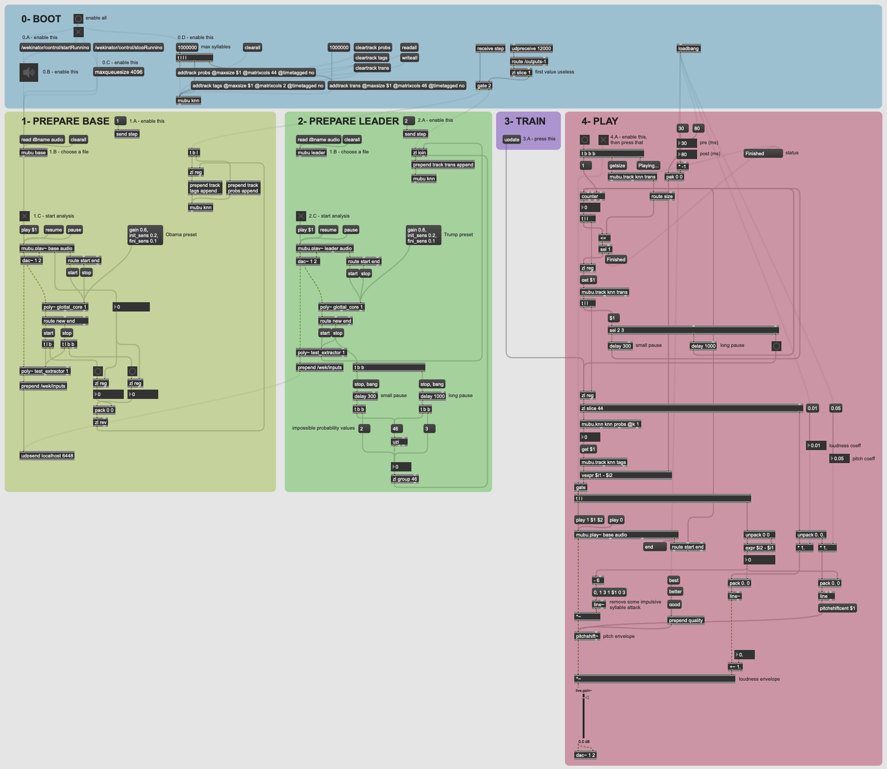
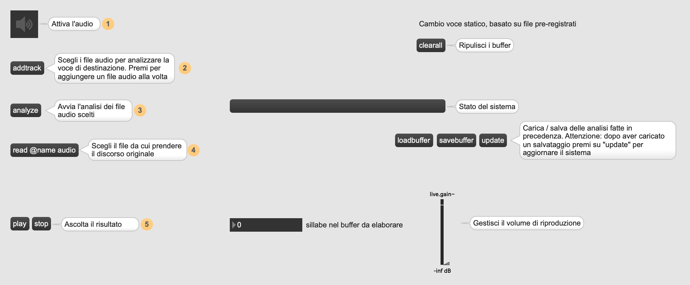

# Processi Musicali Automatici ed Interattivi

### Gastaldi Paolo

| Progetto esame del 23 / 10 / 2020 | |
| :- | :-: |
| Versione | 1.2.0 |
| Data | 08 / 10 / 2020 |

## Indice

+ [Abstract](#abstract)
+ [Obiettivi](#obiettivi)
+ [Come funziona](#come-funziona)
+ [Risultati ottenuti](#risultati-ottenuti)
+ [Informazioni tecniche](#informazioni-tecniche)
    - [Andiamo nel dettaglio](#andiamo-nel-dettaglio)
    - [Usiamo Wekinator](#usiamo-wekinator)
    - [Dipendenze esterne](#dipendenze-esterne)
    - [Difficoltà riscontrate](#difficoltà-riscontrate)

## Abstract

Troppo spesso quando ascoltiamo un discorso ci facciamo influenzare da chi lo stia dicendo, perdendo il significato delle parole che dice. Distaccare le due parti sembra impossibile. E se fosse qualcun altro a pronunciare quel discorso? Stesse parole, stesse frasi, solamente una diversa voce dietro al microfono. Quasi a elevare il discorso in sé a una composizione, a niente più che uno spartito caratterizzato dalle sue sillabe, strutturato nelle sue frasi e colorato con le inflessioni della voce; per andarne poi a cambiare l'esecutore. Forse in quel caso il vero significato ci salterebbe più all'occhio, capiremmo veramente che peso hanno le parole che vengono pronunciate e saremmo in grado di analizzare meglio il discorso. 

<!--
Troppo spesso quando ascoltiamo un discorso ci facciamo influenzare da chi lo stia dicendo, perdendo il significato delle parole che dice. Distaccare le due parti sembra impossibile, a meno che non intervengano elementi di contrasto tali da spostarci l'attenzione su cosa stia avvenendo. Cosa succederebbe se un bellissimo discorso venisse interrotto da una conversazione con termini terribili e crudeli? E se invece le parole del peggiore degli esseri umani venissero rimpiazzate da espressioni di pace e fratellanza?

In questo progetto ho provato a cercare i punti di congiunzione tra discorsi differenti ed influenzarli a vicenda, facendone interagire uno con le parole dell'altro.
-->

## Obiettivi

Gli obiettivi del progetto sono di:

- estrapolare le sillabe da un discorso
- analizzare ogni sillaba e riuscire a trovarne dei parametri caratterizzanti tali da descriverla nella maniera più accurata possibile
- ricreare un discorso con i frammenti di un altro discorso precedentemente analizzati

## Come funziona
_(Sezione in fase di aggiornamento)_

Prima di avviare la patch Max è necessario aprire Wekinator e caricare il progetto _basic_set_2_ presente nella cartella _examples_. Questo include un modello già pronto per il rilevamento delle consonanti e delle vocali.

La patch principale è ```test_class``` che ha il seguente aspetto:



È divisa in 5 sezioni, ciascuna indicata da un colore differente. In ciascuna sezione sono indicati dei passaggi da seguire in ordine alfabetico.

### 0- BOOT

Questa sezione serve per l'avvio del sistema. Vengono create le strutture dati essenziali che verranno poi riempite nei passaggi successivi. Viene anche avviato Wekinator che sarà utile per le sezioni 1 e 2.

In questa sezione è anche possibile caricare una struttura precendentemente riempita o salvare quella attuale tramite i pulsanti _readall_ e _writeall_.

> Come esempio: caricare il file _obama_trump_model.mubu_ dalla cartella _./examples_.
 
### 1- PREPARE BASE

Qua avviene l'analisi della voce a cui si vorrà applicare il discorso. Dopo aver scelto il file audio si passa ad estrarne le sillabe e catalogarle tramite il modello su Wekinator. I risultati dell'analisi e i tempi che indicato onset e offset delle sillabe vengono poi salvati in apposite tabelle in buffer MuBu.

> Come esempio: caricare il file _obama_1.mp3_ dalla cartella _./examples_.

### 2- PREPARE LEADER

Sezione molto simile alla precedente, permette di analizzare il discorso vero e proprio che si vuole come risultato. In questa analisi inoltre si fa uso della loudness e del pitch, utili per seguire le inflessioni della voce (accenti, domande, esclamazioni etc.). Vengono analizzate tra l'altro, come si vede nella parte in fondo, le pause tra le parole e tra le frasi. 

> Come esempio: caricare il file _trump_1.mp3_ dalla cartella _./examples_.

### 3- TRAIN

Sezione molto ridotta, necessaria all'allenamento del sistema che associa le sillabe del leader alle sillabe della base.

### 4- PLAY

Qua si effettua l'esecuzione del risultato. L'obiettivo qui è di ricostruire il discorso associando le sillabe più simili tra quelle estratte dal leader e quelle dalla base. Vengono inoltre ricreate le pause di differente lunghezza. Piccoli inviluppi e altri accorgimenti cercano di evitare di avere risultati troppo frammentati e impulsivi.

È una sezione molto configurabile: si può scegliere quanto anticipare l'onset e quanto ritardare l'offset di una sillaba, quanto far incidere i valori della loudness e del pitch tramite appositi coefficienti, indicare la qualità del cambiamento di pitch etc.


<!--
La patch principale è ```index```. Questa rimanda a 3 sottopatch, chiamate ```wrapper```, che fanno da interfaccia al sistema vero e proprio racchiuso e gestito dalla patch ```voice_switch```.

Una volta scelto un wrapper, se messo nella modalità presentazione verrà visualizzata una schermata simile a questa:



Gli step basilari per poter utilizzare la patch sono:
- attivare l'audio
- scegliere uno o più file audio da cui estrapolare i frammenti
- far analizzare al sistema i file audio scelti

Da qui in poi i vari wrapper permetto di fare azioni differenti.

È possibile anche salvare l'analisi effettuata in precedenza con il pulsante *savebuffer*. Per ricaricarla nel sistema invece bisogna premere su *loadbuffer*, scegliere il file e quindi premere su *update*.

-->

## Risultati ottenuti

### Riconoscimento delle sillabe

La patch ```test_ZFF_2``` è stata utilizzata per creare l'immagine successiva. In seguito sono state aggiunte le sillabe che i vari segmenti andavano a identificare. La porzione di audio è stata estrapolata dal discorso di Barack Obama alla Convention democratica del 2020, che inizia appunto con le parole indicate sull'immagine: *Goodevening everybody*.


Il sistema ha bisogno di una doppia taratura che dipende dalla singola registrazione, sia per l'attacco della sillaba (riconosciuta tramite la ricerca del movimento gutturale), sia per la sua terminazione (riconosciuta con la fine dell'emissione di frequenze formanti della sillaba, ossia delle frequenze utili a identificare la sillaba emessa).

In generale, il sistema sembra essere sempre un po' "in ritardo" sul riconoscimento dell'inizio e della fine della sillaba. Per questo è necessario in seguito delle piccole correzioni tali da adattare meglio la finestra che racchiude la sillaba, modificando accuratamente l'onset e l'offset in fase di esecuzione.

### Alcune esecuzioni

_(Sezione in fase di aggiornamento)_

Nella sottocartella ```examples``` è possibile trovare dei file  di esempio utilizzati per la taratura e il test del sistema.

I file che terminano con *_model* sono dei modelli precedentemente generati dal sistema e che possono essere caricati dalla patch  come precendentemente descritto.

I file che terminano con *_results* sono delle registrazioni ottenuti dal sistema. A volte sono del singolo risultato generato, a volte alternano l'audio originale con la parte generata.
**Attenzione: non sono presenti risultati ottenuti con l'attuale versione della patch.**

La cartella *basic_set_2* contiene il modello Wekinator necessario per il funzionamento della patch. Evitare di modificarne il contenuto.

## Informazioni tecniche

### Andiamo nel dettaglio

_(Sezione in fase di aggiornamento)_

La patch (o meglio, l'insieme di patch) è basato su 4 parti principali, di cui 2 sono componenti di base e 2 invece di più alto livello.

Il primo step è il riconoscimento delle sillabe. Per farlo nella patch ```glottal_core``` viene utilizzato il sistema della ZFF, Zero Frequency Filter, una tecnica per individuare i movimenti gutturali basata su un filtro risonante a (circa) 0 Hz (per maggiori dettagli: Yegnanarayana & Gangashetty, 2011).

Il frammento della sillaba così estratto viene quindi analizzato dalla patch ```test_extractor``` <!-- (contenuta in ```extractor_usystem```) -->. L'analisi consiste nell'estrarre 5 descrittori che vadano a caratterizzare la sillaba:

- loudness: per individuare la vocale associata
- perceptual spectral centroid: brillantezza
- perceptual spectral kurtosis: impulsività e accentuazione della sillaba
- perceptual crest: quanto la cresta è piatta
- perceptual skewness: rapporto tra l'attacco e la decadenza della sillaba

<!--
Questi valori vengono quindi riscalati per occupare tutto il range di valori a loro disposizione.
-->

Di questi valori se ne calcola quindi media e varianza. Quindi vengono passati al modello su Wekinator che ne effettua una categorizzazione. Ne otteniamo una lista di probabilità che ci indicano la presenza o meno di ciascuna consonante, sillaba o dittongo.

Dopo aver effettuato questa analisi per entrambi i file audio (quello da cui si vuole estrarre la voce e quello da cui si vuole estrarre il discorso) si effettua poi "traduzione" delle singole sillabe: tramite un oggetto ```mubu.knn``` si va a individuare la distanza minima tra le sillabe, basandoci sulle probabilità precedentemente ottenute da Wekinator.

Infine, volta individuato il frammento da riprodurre, se ne effettuano ancora alcune elaborazioni "di contorno". Viene applicato un piccolo inviluppo per evitarne un attacco e un rilascio eccessivamente impulsivi, si applicano degli inviluppi sulla loudness e sul pitch per andare a ricreare, per quanto più possibile, gli accenti e il tono della frase originale. 

<!--
Queste 2 patch appena descritte vengono utilizzate per l'analisi e il training del sistema nella patch ```syllable_train_engine```, che permette di analizzare una serie di file pre-caricati in un apposito container MuBu. Per ogni file verranno estratti i riferimenti temporali di ogni singola sillaba e i corrispettivi valori dell'analisi. Al termine dell'analisi viene creato il modello (basato su un algoritmo knn) per un sistema di ricerca della sillaba più vicina.

Per l'esecuzione invece si utilizza la patch ```syllable_play_engine```, che permette di rilevare ed analizzare "in diretta" le sillabe contenute nel segnale in ingresso, andare a cercare per ciascuna la sillaba più prossima dal set di training e riprodurla. 

-->

### Usiamo Wekinator

Questa patch basa il suo funzionamento sul modello ```basic_set_2``` creato in precedenza con Wekinator. Il modello è stato creato tramite la patch ```test_ML```.

L'idea di fondo è creare un modello capace di catalogare le vocali, le consonanti e i dittonghi (poi chiamati _unità fondamentali_) con i loro suoni. Per questo sono stati selezionati 5 parametri (descritti nella precedente sezione) capaci di riassumerne le proprietà.

Il sistema è stato quindi allenato partendo da 44 registrazioni delle unità fondamentali a cui sono stati applicati delle variazioni di pitch (l'intenzione di applicare delle operazioni di stretch, quindi di variarne la dura senza inficiarne il pitch, sono state abbandonate in seguito ad alcune difficoltà pratiche a far interagire MuBu con gli altri sistemi).

Il modello è stato creato tramite l'algoritmo SVM con kernel RGB che permette di identificare cluster dalle forme e dagli incastri molto complicati.

### Dipendenze esterne

Elenco dei pacchetti e programmi aggiuntivi esterni a Max necessari per il funzionamento della patch.

| Dipendenza | Versione |
| :-: | :-: |
| MuBu| 1.9.14 |
| Wekinator | 2.1.0.4 |

### Difficoltà riscontrate

La taratura del sistema è molto delicata. I test sono stati effettuati con la patch ```test_ZFF_2```. Per ogni discorso selezionato è necessario effettuare una (solitamente molto lieve) ritaratura del sistema. Per questo è stato gestito nella patch ```glottal_core``` un set di messaggi appoisti per semplificarne l'operazione.

La catalogazione delle unità fondamentali (vocali, consonanti, dittonghi) è molto complicata con i descrittori audio, nonchè da generalizzare con dei parametri.
In particolare, i descrittori scelti si sono rilevati molto efficaci nel rilevare unità fondamentali con un attacco forte (es. _d_, _t_) o con una coda (es. _s_, _f_), mentre hanno avuto risultati molto scarsi per quanto riguarda le vocali e i dittonghi.
Le generalizzazioni scelte, media e varianza, non hanno riportato un eccessiva perdita di qualità rispetto i risultati ottenuti direttamente dai descrittori. Sicuramente ne hanno beneficiate le prestazioni e il carico a cui era sottoposto il sistema.
Questo problema non è facilmente sormontabile con un sistema senza backward learning, se non con una selezione dei descrittori audio molto accurata, una generalizzazione fine e una grande quantità di campioni.

<!--
Il riconoscimento delle sillabe è basato su un filtro risonante che se tarato troppo "stretto" a 0Hz e con un Q molto selettivo rischia di andare facilmente in feedback. Per questo e per permettere di rilevare anche sillabe sussurrate è stato tarato con parametri più "larghi".
Di contro, questa taratura comporta che il sistema rilevi molte più sillabe spurie dovute alle oscillazioni, soprattutto se vengono pronunciate da una voce ad alto volume o urlata.
-->